# Project Sonar - Radio Stations

This is source code of the [ProjectSonarRadio](https://reforger.armaplatform.com/workshop/62E354B50264C08F-ProjectSonar-RadioStations) mod wich adds radio stations to in-vehicle and static radios.

<picture>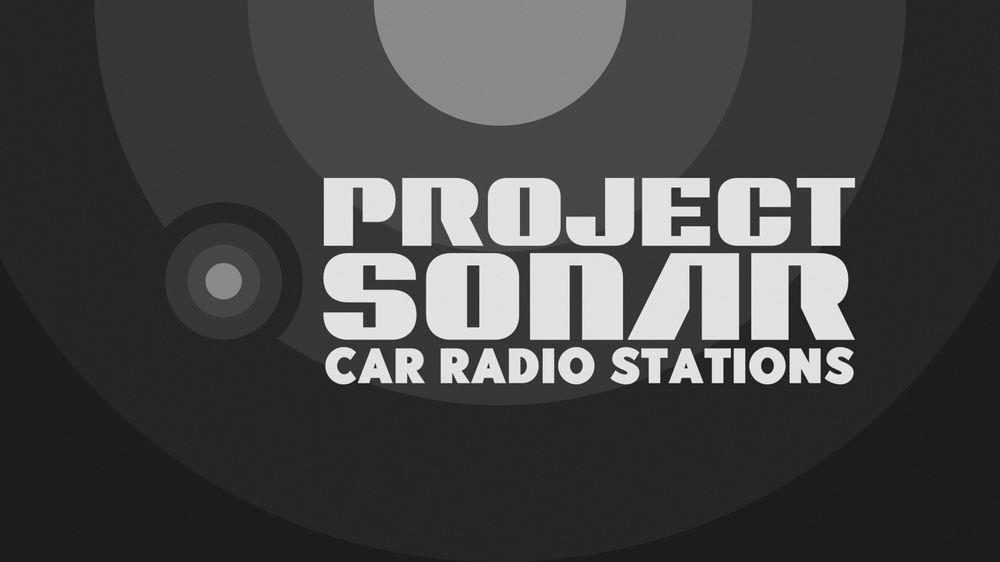</picture>
<picture>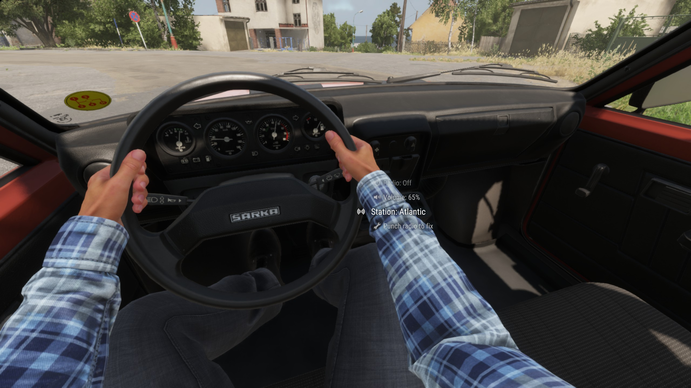</picture>
<picture>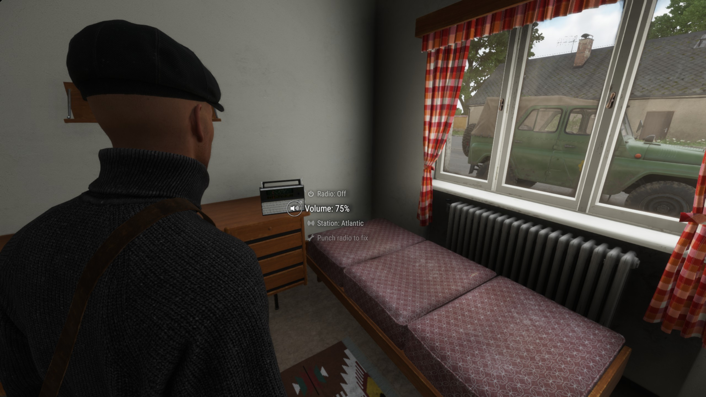</picture>
<picture>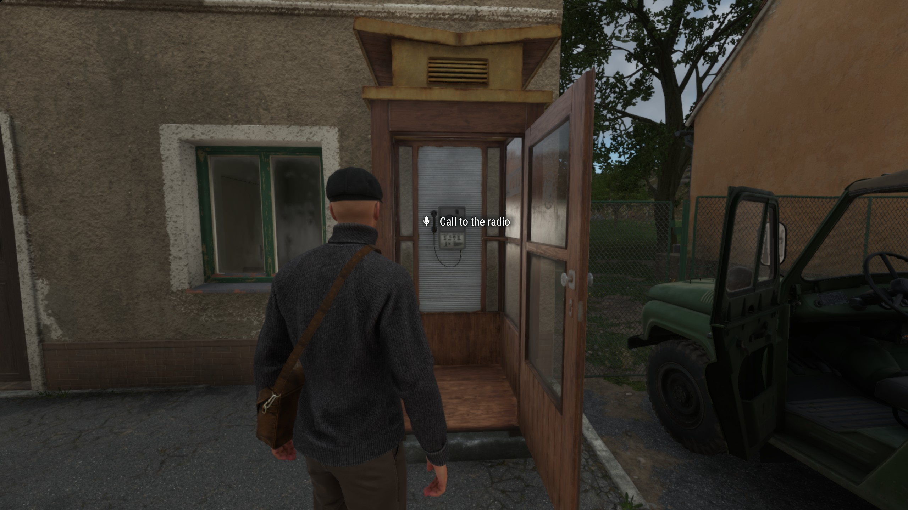</picture>
<picture>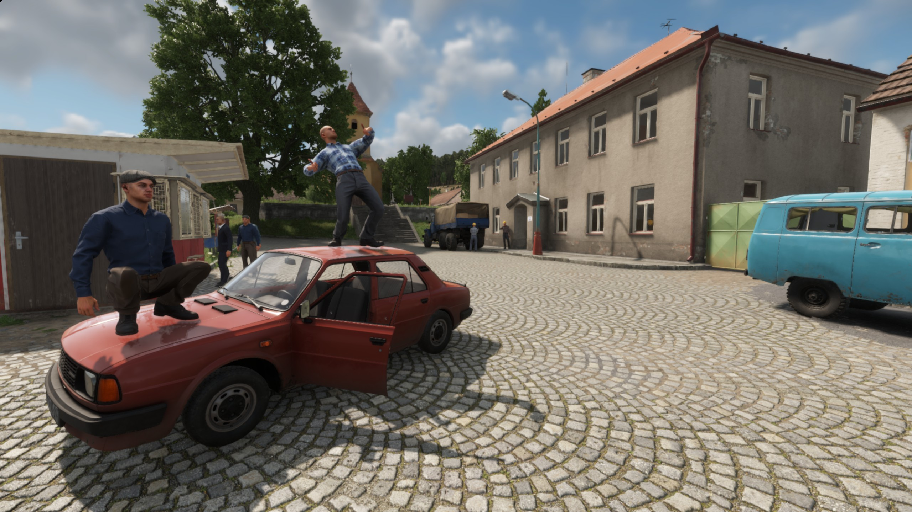</picture>
<picture>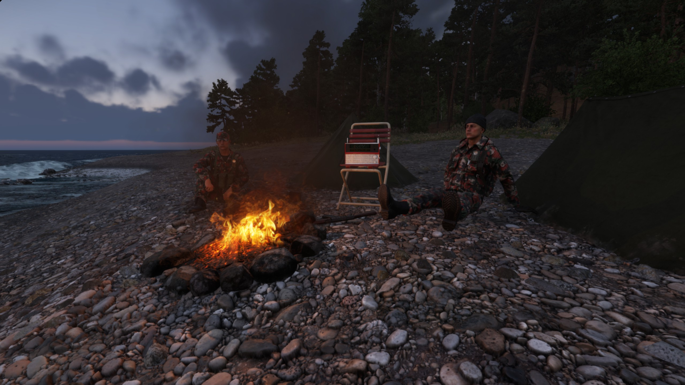</picture>
<picture></picture>
<picture>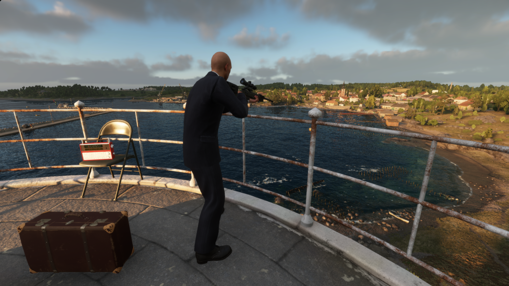</picture>

This mod uses another mod and radio model from there [Car Radio 4 All 621D3771875C1D3D](https://reforger.armaplatform.com/workshop/621D3771875C1D3D-CarRadio4All)

## Features

This mod allows to:
1. Turn on and off the radio in vehicles, such as cars, trucks, helicopters (as in [Car Radio 4 All](https://reforger.armaplatform.com/workshop/621D3771875C1D3D-CarRadio4All)) and in static radios around the world.
2. Change volume of the radio.
3. Change radio stations (if having other mods with it<!-- (see [Examples](#examples-radio-stations-by-me-and-friends)) -->)
4. Enjoy the same tracks with all your friends or enemies in Multiplayer (on/off state, current selected station, volume, sound position, etc).

Additionally:
1. The tracks continue and switch regardless of whether the radio is on or off (like reallife radio).
2. Ability to change radio station by calling to radio by phone in houses or phonebooth.
3. For fixing some syncronization bugs (or other debug features) Game Master can spawn Antenna with Radio
   
   <picture>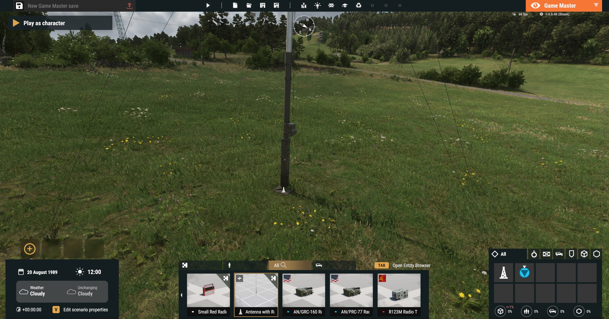</picture>
   <picture>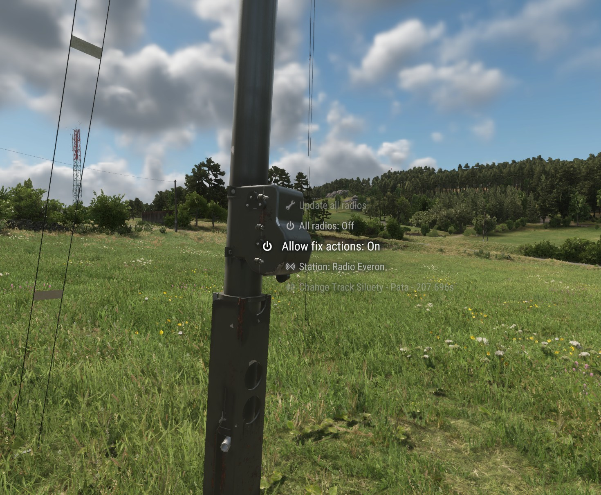</picture>

    GM can:
   - Update all active radio (syncronize them with the server).
   - Turn On/Off ability to use radios.
   - Show fix action on all radios. This action syncronizes a specific radio between the server and all players.
   - Change to next track on one specific radio station.

<!-- ## Examples: radio stations by me and friends
<picture><a href="https://reforger.armaplatform.com/workshop/65B5407553C40DC8" target="_blank" >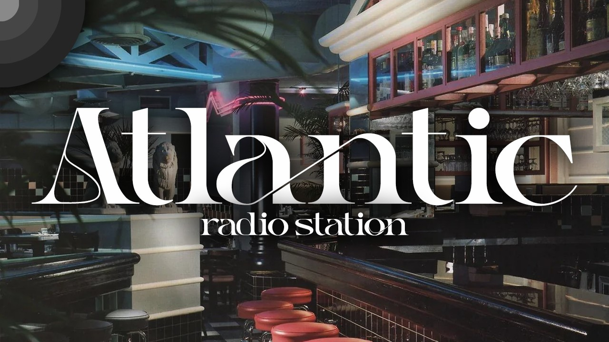</a></picture>
<picture><a href="https://reforger.armaplatform.com/workshop/65B52CBBC2551296" target="_blank" >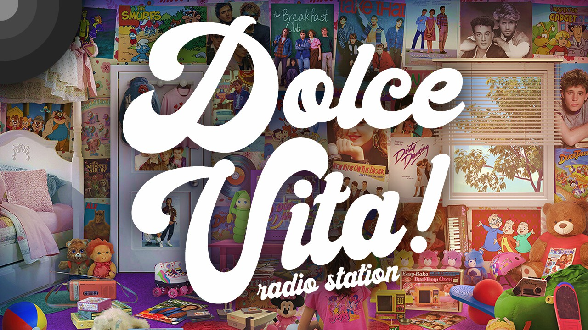</a></picture>
<picture><a href="https://reforger.armaplatform.com/workshop/64C327610D57AE60" target="_blank" >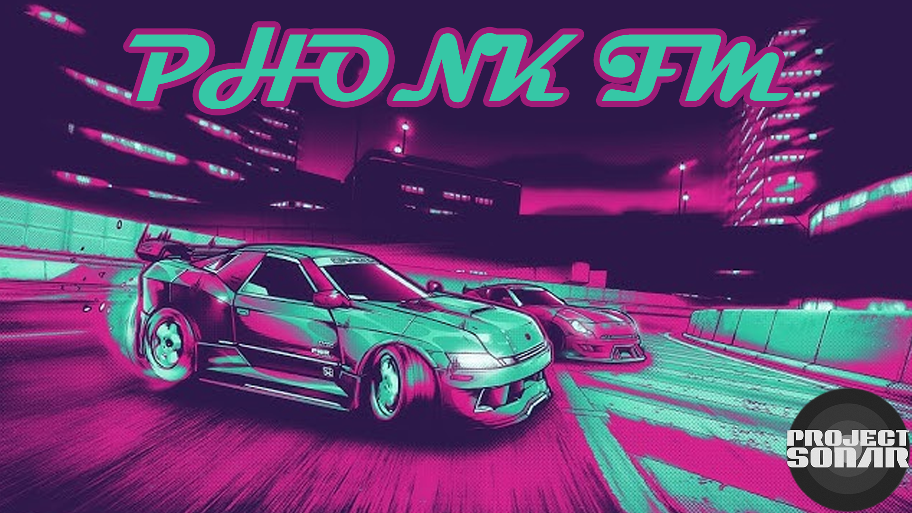</a></picture>
<picture><a href="https://reforger.armaplatform.com/workshop/64C54E100E1B89CB" target="_blank" >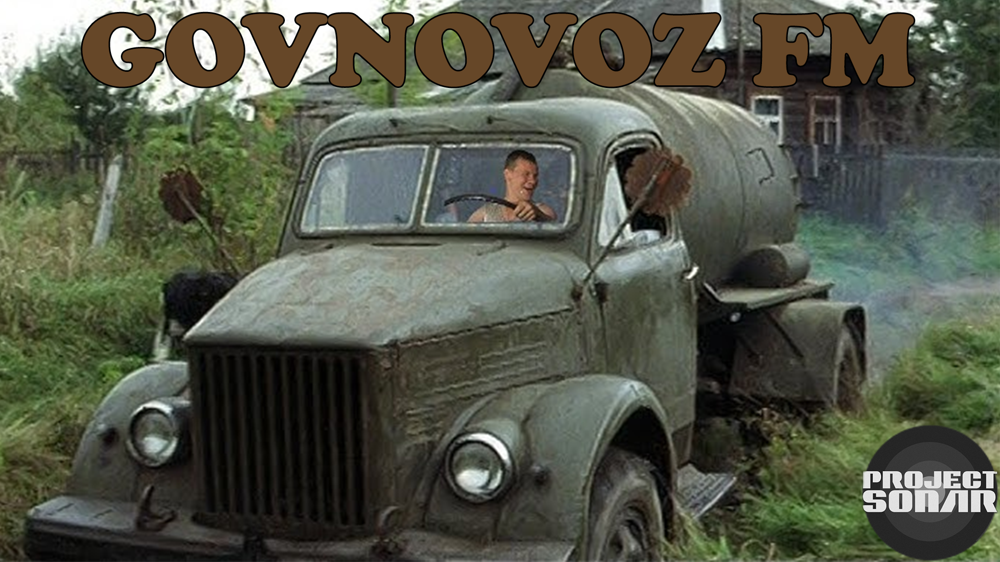</a></picture>
<picture><a href="https://reforger.armaplatform.com/workshop/65ACCE73483B2D24" target="_blank" >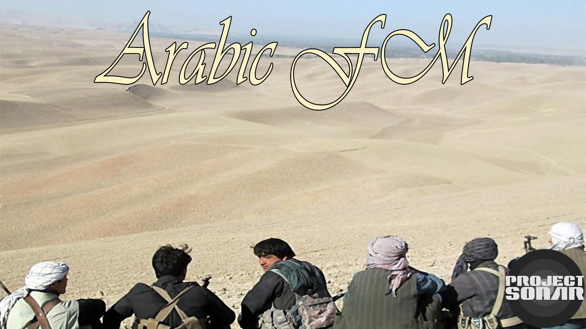</a></picture> -->

## Create your own RadioStation

To create your own radiostation go and check [tutorial README.md](./tutorial)

# License
<a rel="license" href="https://www.bohemia.net/community/licenses/arma-public-license" target="_blank" > This work is licensed under the Arma Public License</a>