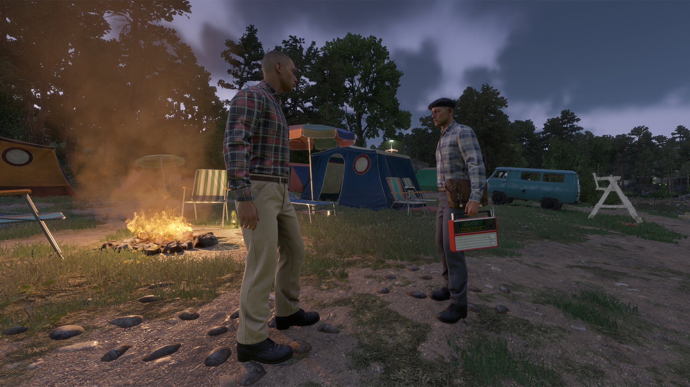
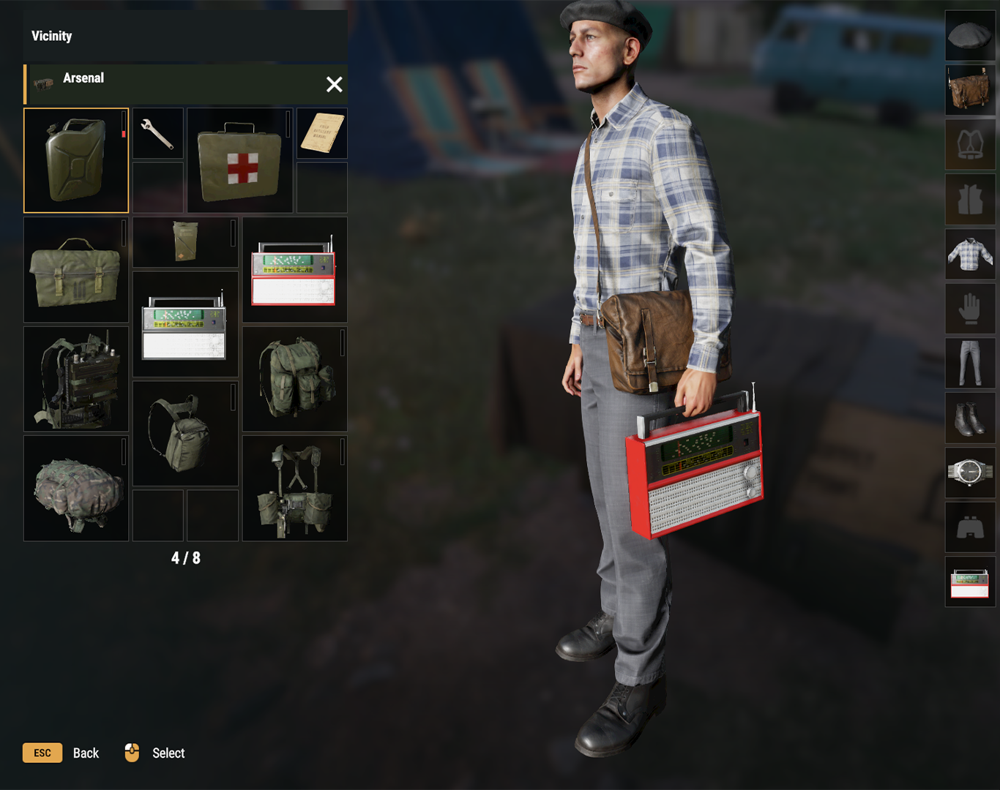
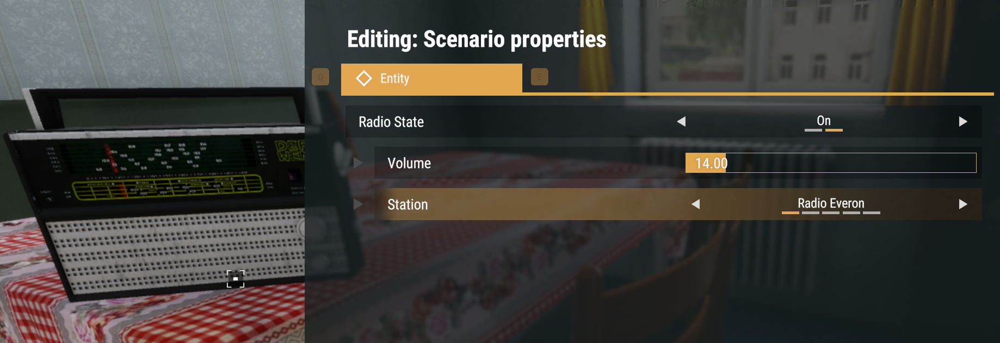
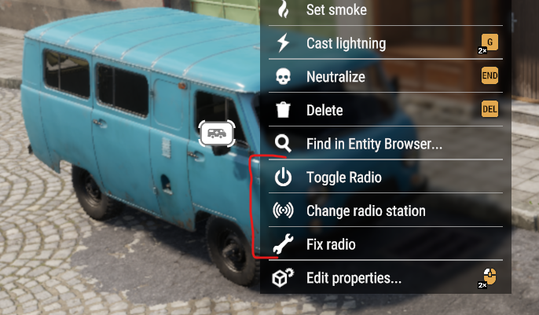

# Project Sonar - Radio Stations

This is source code of the [ProjectSonarRadio](https://reforger.armaplatform.com/workshop/62E354B50264C08F-ProjectSonar-RadioStations) mod wich adds radio stations to in-vehicle and static radios.

<picture></picture>
<picture></picture>
<picture></picture>
<picture></picture>
<picture></picture>
<picture></picture>
<picture></picture>
<picture></picture>

This mod uses another mod and radio model from there [Car Radio 4 All 621D3771875C1D3D](https://reforger.armaplatform.com/workshop/621D3771875C1D3D-CarRadio4All)

## Features

This mod allows to:
1. Turn on and off the radio in vehicles, such as cars, trucks, helicopters (as in [Car Radio 4 All](https://reforger.armaplatform.com/workshop/621D3771875C1D3D-CarRadio4All)) and in static radios around the world.
2. Change volume of the radio.
3. Change radio stations (if having other mods with it<!-- (see [Examples](#examples-radio-stations-by-me-and-friends)) -->)
4. Enjoy the same tracks with all your friends or enemies in Multiplayer (on/off state, current selected station, volume, sound position, etc).

Additionally:
1. The tracks continue and switch regardless of whether the radio is on or off (like reallife radio).
2. Ability to change radio station by calling to radio by phone in houses or phonebooth.
3. You can change volume of the radio in Audio Settings.
4. Bring a radio with you by getting a portable radio from the arsenal.
   
<picture></picture>
<picture></picture>

5. For fixing some syncronization bugs (or other debug features) Game Master can spawn Antenna with Radio 
   
   <picture></picture>
   <picture></picture>

    GM can:
   - Update all active radio (syncronize them with the server).
   - Turn On/Off ability to use radios.
   - Show fix action on all radios. This action syncronizes a specific radio between the server and all players.
   - Change to next track on one specific radio station.
   - GM can Turn On/Off radio, Change radio station, Change volume in Edit Entity Menu
   - GM can Turn On/Off radio, Change radio station in Context Menu

   <picture></picture>
   <picture></picture>
   <picture></picture>

<!-- ## Examples: radio stations by me and friends
<picture><a href="https://reforger.armaplatform.com/workshop/65B5407553C40DC8" target="_blank" ></a></picture>
<picture><a href="https://reforger.armaplatform.com/workshop/65B52CBBC2551296" target="_blank" ></a></picture>
<picture><a href="https://reforger.armaplatform.com/workshop/64C327610D57AE60" target="_blank" ></a></picture>
<picture><a href="https://reforger.armaplatform.com/workshop/64C54E100E1B89CB" target="_blank" ></a></picture>
<picture><a href="https://reforger.armaplatform.com/workshop/65ACCE73483B2D24" target="_blank" ></a></picture> -->

## Settings

You can modify some settings in the server config in missionHeader as field <code>m_ProjectSonar_Settings</code>.

Available Settings:

|Field|Value type|Description|
|:---|:---|:---|
|<code>m_aBlacklist</code>|[ <code>"Array"</code> , <code>"Of"</code> , <code>"Names"</code> ]|Stations that should not be available to use (Station names). **Default:** <code>[]</code> |
|<code>m_aWhitelist</code>|[ <code>"Array"</code> , <code>"Of"</code> , <code>"Names"</code> ]|Stations that should be available to use (Station names). **If filled in, it is used as a list of used stations.** **Default:** <code>[]</code>|
|<code>m_bHideTelephoneAction</code>|<code>true</code> or <code>false</code>|Hides action to call to the radio on telephones. **Default:** <code>false</code>|
|<code>m_RandomizationMethod</code>|<ul><li><code>0</code> (SHUFFLE_ONCE)</li><li><code>1</code> (NO_SHUFFLE)</li><li><code>2</code> (TRUE_RANDOM)</li><li><code>3</code> (RANDOM_WITHOUT_CONSECUTIVE_REPEATS)</li></ul>|Randomization method applied to the track list at stations. **Default:** <code>0</code>|
|<code>m_bPortableRadioPlaysFromInventory</code>|<code>true</code> or <code>false</code>|Allows Portable Radio to play inside inventory. **Default:** <code>false</code>|

**missionHeader** Example:
```
"missionHeader": {
    "m_ProjectSonar_Settings": {
      "m_aBlacklist": [
         "Radio Everon",
         "Playback FM"
      ],
      "m_aWhitelist": [         
      ],
      "m_bHideTelephoneAction": true,
      "m_RandomizationMethod": 2,
      "m_bPortableRadioPlaysFromInventory": true
    }
}
```

## Create your own RadioStation

To create your own radiostation go and check [tutorial README.md](./tutorial)

## Add radio to your vehicle

To add radio to your vehicle go and check [tutorial README_Vehicle.md](./tutorial/README_Vehicle.md)

# License
<a rel="license" href="https://www.bohemia.net/community/licenses/arma-public-license" target="_blank" ><br>This work is licensed under the Arma Public License</a>