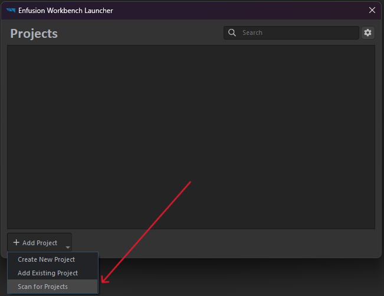

# Tutorial to create your own 

To create a new radio station, you need to do the following:

- [Tutorial to create your own](#tutorial-to-create-your-own)
  - [Project creation](#project-creation)
  - [Duplicating audio project file](#duplicating-audio-project-file)
  - [Adding music tracks](#adding-music-tracks)
  - [Override file SystemsConfig.conf](#override-file-systemsconfigconf)
    - [Getting a list of track lengths using a powershell script (Windows)](#getting-a-list-of-track-lengths-using-a-powershell-script-windows)
  - [Testing](#testing)
  - [Publishing](#publishing)

## Project creation

You need to create a new Project in Arma Reforger Tools

<picture></picture>
<picture></picture>

> [!IMPORTANT]
> Add ProjectSonarRadio as a dependency.

> [!TIP]
> You can also see more information about creating a project at [BI wiki](https://community.bohemia.net/wiki/Arma_Reforger:Mod_Project_Setup).


## Duplicating audio project file

Duplicate CustomRadioBroadcast.acp to your project from \ProjectSonar\Sounds\RadioBroadcast\

<picture></picture>
<picture></picture>
<picture></picture>

Name the file as you like.

<picture></picture>


## Adding music tracks

Find the newly created file in your system, create a Samples folder next to it and place your tracks there. If you want to add DJ tracks, you can create a subfolder for DJ tracks inside the Samples folder.

<picture></picture>

<picture></picture>


Open created audio project file (.acp) and find Bank Music (or DJ) there.

<picture></picture>

Scroll to Samples category. Clear the existing placeholder tracks there.

<picture></picture>

Drag your tracks from the Samples folder to Bank Music or DJ node.

<picture></picture>
<picture></picture>
<picture></picture>

> [!IMPORTANT]
> Bank files **Music** and **DJ** **MUST** have atleast 1 track.


## Override file SystemsConfig.conf

Override SystemsConfig.conf in your project from \ProjectSonar\Configs\Systems\SystemsConfig.conf

<picture></picture>
<picture></picture>

Expand Systems > RT_PS_CustomRadioAntennaSystem > Radiostations.
Add a new radio station by clicking on +.
Expand added RT_PS_CustomRadioStation.

<picture></picture>

<picture></picture>

Fill **Radiostation Name**, **Station Audio Project** (select the previously created .acp file).

Fill **Track Length** with length of your tracks (in seconds).

> [!NOTE]
> To get a list of all lengths you can use [powershell script](#getting-a-list-of-track-lengths-using-a-script-windows)

> [!TIP]
> If **not** need DJ tracks. You can leave **DJ Tracks Length** empty or set **DJ Probability** to 0

> [!TIP] 
> If you need DJ tracks.
> Fill **DJ Tracks Length** with length of your tracks.
> Fill **DJ Probability** to launch dj tracks with some probability.


<picture></picture>
<picture></picture>


### Getting a list of track lengths using a powershell script (Windows)

0. if you know how to execute scripts see point 4.
1. Open PowerShell as administrator.
2. Check execution policy by ```Get-ExecutionPolicy``` and remember printed value (for further reverting).
3. Set new execution policy by ```Set-ExecutionPolicy RemoteSigned``` and approve it by type ```A```.
4. Download ```getTimes.ps1``` file.
5. Go to directory with file ```getTimes.ps1``` by command ```cd <Path>```
6. execute ```./getTimes.ps1``` with first argument of directory with music tracks **in brackets**

> [!IMPORTANT]
>  Quotes around path and backslash at the end of the path are important

7. If you need - revert old execution policy by ```Set-ExecutionPolicy <remembered-policy>```.


<picture></picture>

## Testing

To test your radio station, you can open the existing world in the ProjectSonarRadio mod (\ProjectSonar\worlds\Empty.ent)

<picture></picture>
<picture></picture>

Go to any vehicle or radio and check the functionality of your radio station.

<picture></picture>

## Publishing

> [!TIP]
> The publishing process is best described at [BI wiki](https://community.bistudio.com/wiki/Arma_Reforger:Mod_Publishing_Process)

<picture></picture>
<picture></picture>