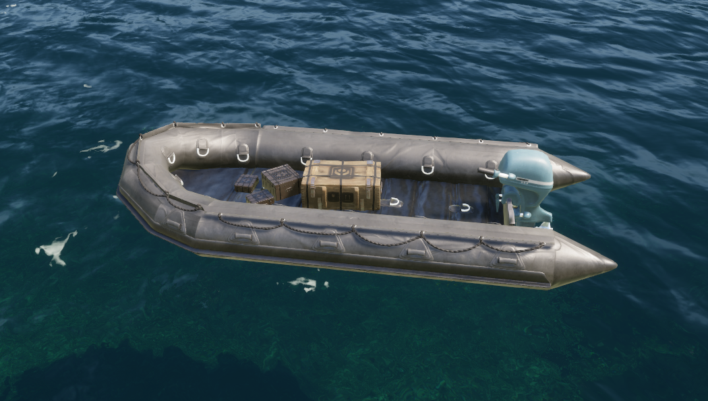
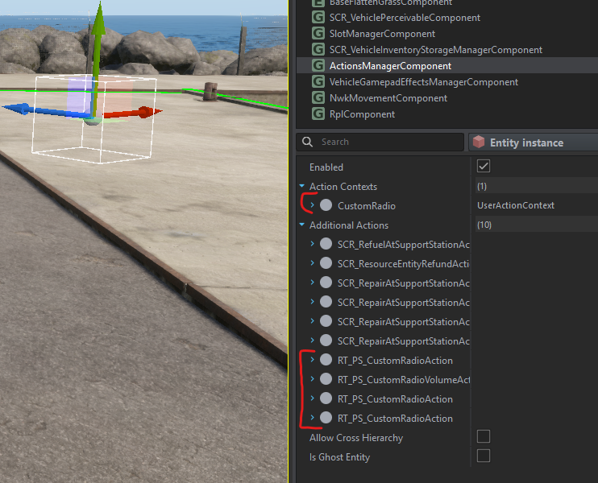
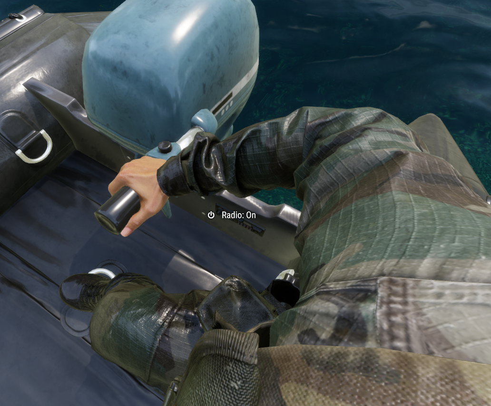

# Tutorial to create your own radio on a new vehicle

This tutorial describes how to add a radio to your vehicle (You need a basic skill of working in Reforger Tools).

Let's take a [Big Chungus Motorbike (61B84088181A8FA4)](https://reforger.armaplatform.com/workshop/61B84088181A8FA4-BigChungusMotorbike) as an example.

<picture></picture>

> [!IMPORTANT]
> If your vehicle is not inherited from Vehicle_Base.et see [Not Common Vehicle section](#not-common-vehicle).

In your vehicle prefab find a SlotManagerComponment, then find CustomRadio Slot and **Enable** it, afterwards **Position** (and **Rotate**) it to where you want.

> [!IMPORTANT]
> It is better to set Pivot ID to a part of the model on which the radio will be attached. Otherwise you will get what is described in [Troubleshooting section](#troubleshooting)

<picture></picture>
<picture></picture>

Then find ActionsManagerComponent and find CustomRadio context. Then **Position** it where you want.

<picture></picture>
<picture></picture>

And rotate it as you want. You can enable **context visibility angle visualization** to better understand the direction of the action field of view. 

<picture></picture>
<picture></picture>
<picture></picture>

And then you can test it.

<picture></picture>

## Not Common Vehicle 

If your vehicle isn't inherited from Vehicle_Base.et you will need to copy slot and actions to your vehicle.

Let's take a boat from [Usable boats (999000999BE11000)](https://reforger.armaplatform.com/workshop/999000999BE11000-Usableboats) as an example.

<picture></picture>

Find Vehicle_Base.et prefab and add it to a world to copy values.

<picture></picture>

Add a new EntitySlotInfo to your vehicle's SlotManagerComponment and copy values from Vehicle_Base.et

<picture></picture>

Then copy context and actions from ActionsManagerComponent of Vehicle_Base.et to your prefab's ActionsManagerComponent.

> [!TIP]
> Create actions in the same order to make it look like ordinary vehicles.
> 
<picture></picture>

Then position slot and actions context in the same way as in the previous section.

<picture></picture>

<picture></picture>
<picture></picture>

## Troubleshooting

If you see something like this, you need to position CustomRadio slot and CustomRadio action context relative to a part of a vehicle. 

<picture></picture>

You need to set Pivot ID and position them relative to this part. 

<picture></picture>

<picture></picture>
